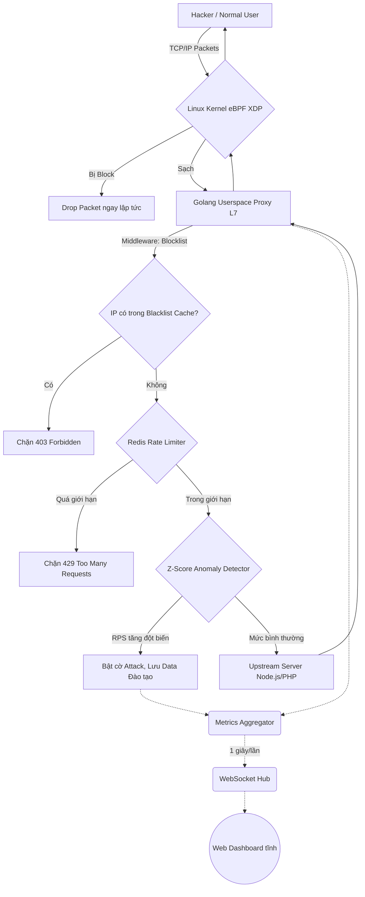

# Kiến trúc và Thuật toán phòng vệ của Noxis Shield

Tài liệu này trình bày toàn bộ nguyên lý hoạt động, cấu trúc phân tầng và các thuật toán bảo mật cốt lõi giúp Noxis Shield trở thành một hệ thống bảo vệ ứng dụng web (WAF) & chống Tấn công Từ chối Dịch vụ (DDoS) toàn diện.

---

## 1. Tổng quan Dự án (Noxis Shield 3-in-1)

Noxis Shield không chỉ đơn thuần là một proxy server. Nó là một hệ sinh thái bảo mật hoàn chỉnh được thiết kế theo mô hình **3-in-1**:

1. **The Layer 3/4 Shield (eBPF Kernel Driver):** Hoạt động sâu trong lõi hệ điều hành (Linux Kernel), thực hiện việc "vứt bỏ" (drop) gói tin độc hại bằng mã C trước cả khi gói tin kịp tiến tới vùng nhớ ứng dụng (Userspace).
2. **The Layer 7 Framework (Golang Userspace Proxy):** Một Reverse Proxy siêu tốc độ viết bằng Golang, phân tích sâu nội dung request (HTTP Headers, Path), áp dụng các bộ lọc thông minh (AI, Rate Limit) và định tuyến tới server đích hợp lệ.
3. **The Real-time Dashboard (Web UI & Telemetry):** Một trạm kiểm soát trực quan nhúng thẳng vào file chạy Go (`go:embed`), cập nhật dữ liệu từng giây thông qua WebSocket, biểu diễn dưới dạng biểu đồ Glassmorphism hiện đại thay vì chỉ là các con số khô khan.

**Luồng dữ liệu (Data Flow) tổng quát:**

---

## 2. Chi tiết Thuật toán và Cơ chế Chặn

Noxis Shield áp dụng chiến lược **Phòng ngự chiều sâu (Defense in Depth)**. Nếu kẻ tấn công lọt qua màng lọc này, chúng sẽ bị chặn ở màng lọc phức tạp hơn. Có 3 mô-đun lọc chính:

### A. Tầng 1: Hạ sát tại Kernel bằng eBPF (XDP)
- **Áp dụng:** Tấn công băng thông siêu lớn (Volumetric DDoS) như SYN Flood, UDP Flood.
- **Nguyên lý:** 
  - Khi bạn cấu hình Noxis chạy trên Linux, mã C (`ebpf/xdp_filter.c`) sẽ được biên dịch và gắn (hook) trực tiếp vào card mạng (Network Interface) bằng công nghệ eXpress Data Path (XDP).
  - Thuật toán theo dõi là cực tĩnh và nhẹ (O(1)): Gói tin vào -> Tẽ phần Header IPv4 ra -> Chuyển IP thành struct -> Tìm trong `BPF_MAP_TYPE_HASH` (Bản đồ IP xấu chia sẻ giữa Go và C).
  - Nếu `Map[IP] == Bị cấm`, lệnh `XDP_DROP` được trả về trong vòng dưới 1 micro-giây. CPU không phải xử lý ngắt mạng hay copy bộ nhớ lên Golang.

### B. Tầng 2: Giới hạn tần suất bằng Sliding Window (Redis)
- **Áp dụng:** Tấn công vét cạn mật khẩu (Brute-force), L7 HTTP GET/POST Flood cường độ trung bình - thấp.
- **Nguyên lý:**
  - Thay vì đếm số request theo "từng giây cứng" (Fixed Window) dễ bị lách bằng cách bắn request vào mốc chuyển giao 0.99s và 1.01s, Noxis sử dụng **Sliding Window (Cửa sổ trượt)**.
  - **Thuật toán O(1) qua Lua Script:** Bất cứ khi nào có request, Golang ném IP xuống Redis thực thi 1 block Lua Script nguyên tử (Atomic).
  - Lua script sẽ loại bỏ các timestamp quá hạn (ngoài khung, ví dụ > 10 giây trước), thêm timestamp hiện tại và đếm số lượng.
  - Nếu count > MaxRequests, hệ thống trả về mã lỗi `HTTP 429 Too Many Requests`.

### C. Tầng 3: Nhận diện Cú sốc bằng Z-Score Anomaly Detection 
- **Áp dụng:** Tấn công cường độ thay đổi, Botnet từ từ làm nghẽn cổ chai. Nhận diện các đợt tăng vọt traffic mà không cần đặt một con số `Rate Limit` cứng nhắc dễ sai sót.
- **Thuật toán:** Dựa trên Toán xác suất thống kê (Standard Score / Z-Score).
  1. **Thu thập Baseline (Cơ sở):** Một Goroutine ngầm cứ 1 giây lại thu thập số Requests Per Second (RPS) hiện hành (x) và đẩy vào một khung lịch sử (Base Window).
  2. **Tính Trung bình (μ) và Độ lệch chuẩn (σ):** Hệ thống thường xuyên cập nhật lượng trung bình request và độ lệch chuẩn của khoảng thời gian baseline.
  3. **Công thức Cảnh báo:** Z = (x - μ) / σ
     - Nếu Z > Threshold (Ví dụ Z-Score > 10, nghĩa là lượng traffic cao hơn 10 lần độ lệch chuẩn so với baseline), đó là một mức tăng phi lý bất khả thi (Rất rất hiếm xảy ra tự nhiên) -> Đích thị là Botnet hoặc Tấn công bơm dồn (Spike).
  4. **Hành động:** Hệ thống phát tín hiệu `OnAttackDetected`, kích hoạt còi báo động trên Web Dashboard, đổi màu UI, và tự động phối hợp API để hạ IP hoặc chặn theo Subnet.

---

## 3. Quản trị và Quan trắc (Observability)

Không có hệ thống tường lửa nào là hoàn hảo nếu nó làm việc như một chiếc hộp đen. Noxis cho phép bạn nhìn thấu dữ liệu luân chuyển bên trong.

### Cơ chế Telemetry:
*   **Central Aggregator:** Tại nội bộ lõi Golang, cấu trúc `Metrics Aggregator` dùng bộ đếm bộ nhớ nguyên tử (`atomic.Int64`) thu thập dữ liệu về Pass, Drop, Error không gây ra hiện tượng cạnh tranh tài nguyên hay thắt nút cổ chai (Zero-lock).
*   **Realtime Publish/Subscribe (WebSocket Hub):** Một kênh phát sóng được mở ở cổng 9090. Bất kỳ kỹ sư hay màn hình giám sát nào mở `http://localhost:9090/` lập tức kết nối vào kênh này. Cứ đúng 1 giây 1 lần, Aggregator gói một snapshot JSON và Broadcast đi toàn mạng lưới.

### Backend-Frontend Đồng nhất
Dashboard không đòi hỏi một Web Server phức tạp bên ngoài. Nó chỉ là 3 tệp (`index.html`, `style.css`, `app.js`) sử dụng Javascript thuần chủng.
Khi `go build` chạy, thư viện tiêu chuẩn `go:embed` ép 3 tệp này vào bên trong nhân của tệp `.exe/ELF`. Khiến ứng dụng có thể chạy Độc Lập Hoàn Toàn và bảo đảm phiên bản UI/API nội bộ là ăn khớp chặt chẽ nhất.

---

## 4. Đặc điểm Nổi Bật Chỉ Có Nhờ Triển Khai Go/C/Redis

- **Fail-open Design**: Sự ưu việt được thể hiện nếu như Redis bị sập (hết RAM hoặc chết mạng), Noxis Shield không làm sập theo toàn hệ thống (Cascading failure). Thuật toán Rate Limiter/Blocklist sẽ ghi log lỗi mà vẫn Pass qua traffic người dùng. Nó bảo vệ dịch vụ đích thay vì giết chết nó.
- **Cross-platform**: Ở môi trường non-Linux (Windows/Mac trong phòng Dev), eBPF tự biến mất (Build tags) và thay vào đó bằng Userspace Drop (Bộ lọc map của Go). Đảm bảo mọi lập trình viên lấy code về dùng `go run` được ngay.
- **Tính tự chủ CLI (NoxCtl):** Khả năng điều hành thông qua Unix-socket/Loopback port API `9091` chuyên dụng giúp admin có thể bắn lệnh `noxctl block` an toàn. 

## 5. Kết Luận
Noxis không đơn thuần "Dùng lại thư viện nginx". Nó xây dựng một hệ tiêu chuẩn WAF độc lập, nhanh mượt của C, đa dụng của Go, thẩm mỹ của Glassmorphism, trở thành chốt chặn thượng đỉnh trước cửa ngõ các Microservices hiện đại.
